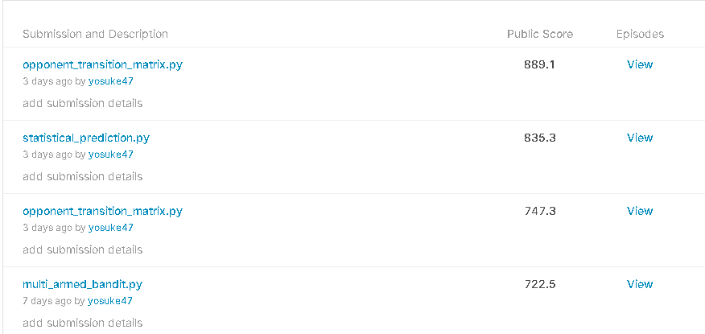

# Rock-Paper-Scissors

じゃんけんコンペ

## Basics
**Overview(DeepL)**

グー、パー、チョキ（時々 roshambo と呼ばれる）は、遊び場の意見の相違を解決したり、誰が道路の旅で前の座席に乗るために取得を決定するための定番となっています。ゲームはシンプルで、力のバランスが取れています。3つの選択肢があり、それぞれが他の2人に勝つか負けるかを選択できます。一連の本当にランダムなゲームでは、それぞれのプレイヤーが勝ったり負けたり、ゲームの大体3分の1を引き分けたりします。しかし、人間は本当にランダムではないので、AIに楽しい機会を与えてくれます。

研究では、グー、パー、チョキAIが一貫して人間の対戦相手を打ち負かすことができることが示されています。過去のゲームをインプットとして、それはパターンを研究してプレイヤーの傾向を理解する。しかし、単純な「ベスト・オブ・3」のゲームを「ベスト・オブ・1000」に拡張するとどうなるのだろうか。人工知能はどれだけのパフォーマンスを発揮できるのでしょうか？

このシミュレーション大会では、この古典的なゲームを何度もラウンドを重ねて対戦するAIを作成します。あなたのAIが負けるよりも、あなたのAIが勝つパターンを見つけることができるでしょうか？マッチがランダムではないエージェントを含む場合、ランダムなプレイヤーを大幅に上回ることが可能です。強いAIは、予測可能なAIに一貫して勝つことができる。

この問題は、機械学習、人工知能、データ圧縮の分野では基本的な問題です。人間の心理学や階層的時間記憶への応用の可能性さえある。手を温めて、この課題でRock, Paper, Scissorsの準備をしましょう。

**Evaluation**
毎日、あなたのチームは最大5人のエージェント（ボット）を大会に提出することができます。各エージェントは、同じようなスキル評価を持つ他のボットとのエピソード（ゲーム）で対戦します。時間が経つにつれて、スキルの評価は、勝てば上がる、負ければ下がるようになります。提出されたボットは、大会終了までゲームをプレイし続けます。リーダーボードには、最高得点を獲得したボットのみが表示されますが、提出物ページではすべての提出物の進捗状況を確認することができます。

各提出物には推定スキル評価があり、ガウシアンN(μ,σ2)でモデル化されており、μは推定スキル、σは推定スキルの不確実性を表し、時間の経過とともに減少します。

提出物をアップロードすると、最初に検証エピソードを再生し、提出物が正しく動作するかどうかを確認します。エピソードが失敗した場合、提出物はエラーとしてマークされます。そうでない場合は、サブミッションをμ0=600で初期化し、継続的な評価のためにすべてのサブミッションのプールに参加します。

すべての提出物のプールからエピソードを繰り返し実行し、公正に一致するように類似の評価を持つ提出物を選択します。1日に8エピソードを実行することを目標としていますが、より早くフィードバックを得られるように、最新の投稿エピソードには若干の追加料金を加えています。

エピソードが終了すると、そのエピソードに含まれるすべての提出物の評価が更新されます。あるサブミッションが勝った場合は、そのサブミッションのμ値を増加させ、相手のμ値を減少させます。更新は、以前のμ値に基づく期待される結果からの偏差と、各提出物の不確実性σとの相対的な大きさを持つことになります。また、結果によって得られる情報量に応じてσの項を減らします。あなたのボットがエピソードに勝ったり負けたりするスコアは、スキル評価の更新には影響しません。

投稿締め切り時に、追加投稿はロックされます。エピソードを継続して実行するために、さらに1週間が割り当てられます。この週の終了時に、リーダーボードは最終的なものとなります。

www.DeepL.com/Translator（無料版）で翻訳しました。

**Data**
|id|symbol|
|--|------|
|0|rock|
|1|paper|
|2|scissors|

## Discussion
|no|title|content|url|
|--|--|--|--|

## Log
### 20201101
 - join
 - とりあえずたわらさんのノートブックコピペで出してみる[url](https://www.kaggle.com/ttahara/rps-simple-baseline)
 - sub_nb_001
  - score:612.5
 - 息抜きがてらagent作っていこ
 - 1000回バトル
  - 予測モデルを作る？でも1秒以内に何出すかを決めないといけない
   - .pyを提出するから相手の出したものを読み取るとかじゃない？
 - じゃんけんのシミュレーションして比較できるnotebook[url](https://www.kaggle.com/ihelon/rock-paper-scissors-agents-comparison)
  - agentが何してるかよくわからない
 - 用意してくれてる関数[url](https://github.com/Kaggle/kaggle-environments/blob/master/kaggle_environments/envs/rps/agents.py)
  - 相手がランダムで出してくるレート帯ならstatisticalでカウントして一番出現率の少ない回数に勝つようだすとか
    - もしかしてこれ？[url](https://www.kaggle.com/alexandersamarin/decision-tree-classifier?scriptVersionId=46574034)
    - それを相手がしてるとしてそれに対して勝つようにする？メタゲーム・・・
     - ↑これだとランダムに負けないか？
 - ObservationとConfigurationの[url](https://github.com/Kaggle/kaggle-environments/blob/master/kaggle_environments/envs/rps/helpers.py)

### 20201116
 - とりあえずall ぐー、チョキ、パーの３種類のagentをsub
 - 公開notebookにある戦術として
 
|tactics name|content|
|------------|-------|
|Hit The Last Own Action|自分が最後に出した行動に対して勝つものを出す（hostのサンプルが相手の出した行動を次の自分の行動にするため）|
|all rock|全部ぐー|
|all paper|全部パー|
|all scissors|全部チョキ|
|Copy Opponent|相手の最後の行動を真似して出す|
|Reactionary|相手が最後に出した行動に対して勝つものを出す|
|Counter Reactionary|・前回自分が勝った時：相手は前回の自分に勝とうとしたのを出してくると予想してそれに勝つものをだす。・前回自分が負けたとき：自分が勝とうとして出すのを相手が読んだのをさらに読んで出す|
|Statistical|相手が出したactionの統計（サンプルなので、returnは相手が最初に出したやつに勝つやつしか返してない）|
|Nash Equilibrium|ナッシュ均衡？ランダムにaction返す|
|Markov Agent|マルコフ連鎖（未来の挙動が現在の値だけで決定され、過去の挙動と無関係であるという性質を持つ確率過程）ちょっと何したいかわからない|
|Memory Patterns|3回分のじゃんけんの結果から、過去に記録していたパターンと一致するものを探して勝つように出す（見つからなかったらランダム）|
|Multi Armed Bandit|マルチアームド・バンディットのアプローチは、強化学習の技術で、最も有望な対抗戦略を選択して、それを使って相手を打ち負かす|
|Opponent Transition Matrix|3つの状態と3x3の遷移行列を持つ単純なマルコフ連鎖を作成|
|Decision Tree Classifier||
|Statistical Prediction|ゲーム履歴を構築し、統計的に重み付けされた推測を行い、その予測を対戦相手が実際にプレイしたものと比較する|
 
### 20201117
 - まだ提出していないagentの5種類も提出（上の戦術のやつ）
 - これがデータ定義書らしいjsonだとよ[url](https://github.com/Kaggle/kaggle-environments/blob/master/kaggle_environments/envs/rps/rps.json)
 - Observation, Configurationのクラスがdefに渡される。このクラスはjsonのデータにアクセスしてる
 - ちょっと何してるかわかってきた
 
### 20201119
 - routine10
 - routine50
  - 上記２つのファイル出した。繰り返し同じ行動をする。同じのを出し続けたらそれに勝つように出してくるのではというアイデアからサブしてみた→エラーになります・・・
  - サブすらままならない、はあ～～～～～（くそでかためいき）
 - agentの勝利のルールが変わったらしい
 
### 20201121
 - 既存のagentの調査
 
### 20201128
 - Multi-armed bandit vs deterministic agentsでやってるけど過去のデータを予測として使いたかったらcsvにして保存したり読み込んだりする
 - Amazonブラックフライデーセールで自作PCパーツ買った。ヤルゾ

### 20201129
 - agengtの戦略を解説してくれてる(https://www.kaggle.com/gpreda/rock-paper-scissors-strategies)
  - Play constantly：常に同じオプション
  - Nash Equilibrium：この戦略を採用している各プレイヤーは、3つの選択肢のそれぞれが等しい確率で、毎回1/3の確率でプレイするようにランダムにプレイする。補足[url](http://www.science4all.org/article/game-theory/)
  - Mirror opponent behavior：エージェントは相手の最後の行動をする。この戦略は、相手が一定の戦略を実行している場合は引き分け、そうでない場合は負けるか勝つかの確率が等しいという前提に基づいている。
  - Mirror opponent behavior with shift：相手の行動に対してシフトした行動を返す。
  - Shift with constant：1つのステップごとに固定された値で常に自分のプレイをシフト。相手がこちらの戦略をミラーリングしているときにうまく動作
  - Transition matrix：3つの状態と3x3の遷移行列を持つ単純なマルコフ連鎖を作成します。一様な確率で初期化し、データから遷移行列を学習して相手の次の一手を予測
  - 現在提出しているscore
  - 
  - opponent_transition_matrixを2つsubしてるけど（なぜだ・・・）スコアが全然違う
  - 特に戦略として思いつくことがなかったけど、本棚に深層強化学習入門がある。過去のワイグッジョブ。これで何か使えるところないかな。
  
